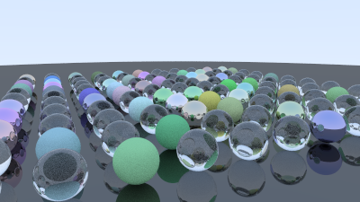
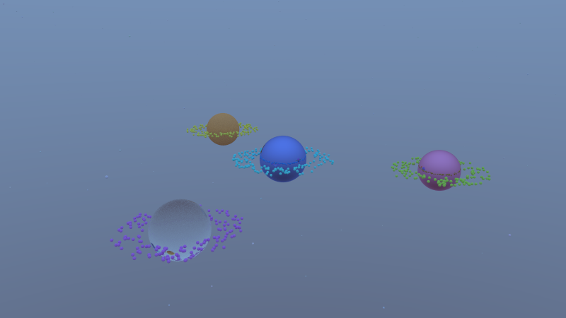

# 🌄 Ray Tracer in C++

A lightweight ray tracer written in modern C++. This project renders simple 3D scenes using core ray tracing techniques such as ray-object intersection, surface normals, and anti-aliasing. It outputs images in the `.ppm` format for easy viewing and editing.

## ✨ Features

- **Ray-Sphere Intersection**: Calculates intersections between rays and spheres to generate visible geometry.
- **Surface Normals**: Adds basic shading by mapping normals to RGB values.
- **Camera Setup**: Implements a virtual camera with controllable viewport and focal length.
- **Anti-Aliasing**: Reduces jagged edges by averaging multiple samples per pixel.

## 🧱 Project Structure

- `vec3.h`: Vector class for 3D math.
- `ray.h`: Ray definition and point-at-parameter logic.
- `interval.h`: Utility for clamping and bounding intervals.
- `hittable.h`, `hittable_list.h`: Abstract and composite object interfaces.
- `sphere.h`: Sphere implementation for ray-surface intersection.
- `main.cpp`: Entry point that assembles the scene and renders the image.

## 🖼️ Output



<p >  </p> <p><b>Before and After Anti-Aliasing</b></p>


The program generates a `.ppm` file (`image.ppm`) which can be opened using tools like:
- [ImageMagick](https://imagemagick.org) (`display image.ppm`)
- `feh` or any modern image viewer that supports PPM

## ⚙️ Build Instructions

```bash
g++ -std=c++17 -O2 -o raytracer main.cpp
./raytracer > image.ppm
